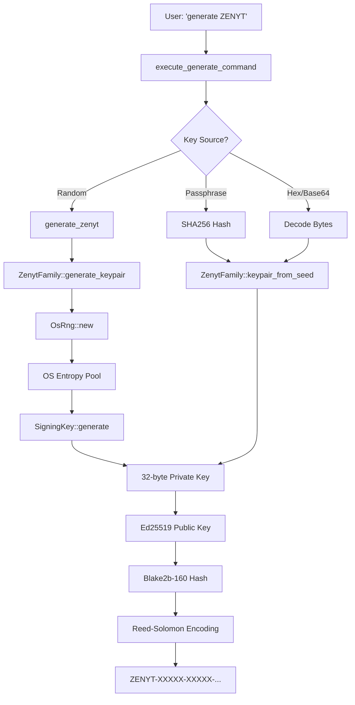

# Entropy and Randomness in Jantar Address Generation

*Last updated: 2025-08-20*

## Executive Summary

Jantar's cryptographic address generation relies on **`rand::rngs::OsRng`** for entropy, which provides cryptographically secure random numbers from the operating system. This is the gold standard for cryptographic randomness in Rust applications.

## Entropy Sources by Cryptocurrency Family

### 1. ZENYT (Native)
```rust
use rand::rngs::OsRng;

fn generate_keypair(&self) -> Result<KeyPair> {
    let mut csprng = OsRng;  // ← Operating System RNG
    let signing_key = SigningKey::generate(&mut csprng);
    let verifying_key = signing_key.verifying_key();
    // ...
}
```
- **Algorithm:** Ed25519
- **Entropy Source:** `OsRng` - OS-provided CSPRNG
- **Key Size:** 256 bits (32 bytes)
- **Method:** `SigningKey::generate()` internally uses the provided CSPRNG

### 2. Bitcoin Family (BTC, LTC, DOGE)
```rust
use rand::rngs::OsRng;

fn generate_keypair(&self) -> Result<KeyPair> {
    let mut rng = OsRng;  // ← Operating System RNG
    let (secret_key, public_key) = self.secp.generate_keypair(&mut rng);
    // ...
}
```
- **Algorithm:** secp256k1
- **Entropy Source:** `OsRng` - OS-provided CSPRNG
- **Key Size:** 256 bits (32 bytes)
- **Method:** `secp256k1` library's `generate_keypair()` uses the provided RNG

### 3. Ethereum Family
```rust
use rand::rngs::OsRng;

fn generate_keypair(&self) -> Result<KeyPair> {
    let mut rng = OsRng;  // ← Operating System RNG
    let secret_key = SecretKey::new(&mut rng);
    let public_key = PublicKey::from_secret_key(&self.secp, &secret_key);
    // ...
}
```
- **Algorithm:** secp256k1 (same curve as Bitcoin)
- **Entropy Source:** `OsRng` - OS-provided CSPRNG
- **Key Size:** 256 bits (32 bytes)
- **Method:** `SecretKey::new()` generates random bytes using OsRng

### 4. NXT Family (BURST, NXT, ARDOR)
```rust
fn generate_keypair(&self) -> Result<KeyPair> {
    let mut rng = rand::thread_rng();  // ← Thread-local RNG (seeded from OS)
    let passphrase = generate_random_passphrase(&mut rng);
    self.keypair_from_passphrase(&passphrase)
}
```
- **Algorithm:** Curve25519
- **Entropy Source:** `rand::thread_rng()` - Thread-local RNG seeded from OS entropy
- **Key Derivation:** Passphrase → SHA256 → Private Key
- **Note:** Less direct but still cryptographically secure

## What is OsRng?

`OsRng` (Operating System Random Number Generator) is a cryptographically secure pseudo-random number generator (CSPRNG) that obtains entropy directly from the operating system:

### Platform-Specific Implementations

| Platform | Entropy Source | System Call | Notes |
|----------|---------------|-------------|-------|
| **Linux** | `/dev/urandom` | `getrandom()` syscall | Blocks only until initialized |
| **macOS** | `/dev/random` | `getentropy()` | Non-blocking, always available |
| **Windows** | CryptoAPI | `BCryptGenRandom()` | Uses Windows CNG (Cryptography Next Generation) |
| **FreeBSD** | `/dev/random` | `kern.arandom` sysctl | CSPRNG with Fortuna algorithm |

### Entropy Gathering by the OS

The operating system gathers entropy from multiple hardware sources:

1. **Hardware Events**
   - Keyboard timings
   - Mouse movements
   - Disk I/O timings
   - Network packet arrival times

2. **CPU-Based Sources**
   - Intel RDRAND/RDSEED instructions (if available)
   - ARM RNDR register (on newer ARM processors)
   - Jitter in CPU instruction timing

3. **Dedicated Hardware (if present)**
   - Hardware Security Modules (HSM)
   - Trusted Platform Module (TPM)
   - Hardware random number generators

## Security Analysis

### Strengths ✅

1. **Industry Standard:** `OsRng` is the recommended CSPRNG for cryptographic operations in Rust
2. **No Seed Management:** The OS handles entropy pooling and reseeding
3. **Fork Safety:** Automatically reseeds after process forking
4. **Thread Safety:** Each call gets fresh entropy from the OS
5. **Unpredictability:** Cannot be predicted even with knowledge of previous outputs

### Potential Concerns ⚠️

1. **OS Dependency:** Security depends on the OS's entropy gathering
2. **Early Boot:** On Linux, very early in boot process, entropy might be limited
3. **Virtualization:** VMs may have reduced entropy sources
4. **Embedded Systems:** IoT devices might have fewer entropy sources

### Mitigations in Jantar

- **No Early Generation:** Jantar generates keys on-demand, not at startup
- **User-Triggered:** Key generation happens when user explicitly requests it
- **Alternative Sources:** Users can provide their own entropy via:
  - Hex-encoded private keys
  - Base64-encoded seeds
  - Passphrases (hashed with SHA256)
  - WIF format (for Bitcoin family)

## Command-Line Usage Examples

```bash
# Generate with OS entropy (recommended)
[Alice]> generate ZENYT

# Generate with user-provided entropy
[Alice]> generate ZENYT "my very long passphrase with lots of entropy"

# Generate with hex-encoded seed
[Alice]> generate ZENYT 0x1234567890abcdef1234567890abcdef1234567890abcdef1234567890abcdef

# Generate with base64-encoded seed
[Alice]> generate ZENYT SGVsbG8gV29ybGQgVGhpcyBJcyBBIFRlc3QgS2V5IQ==
```

## Best Practices for Users

1. **Use OS Entropy:** Default generation without parameters is secure
2. **Sufficient Passphrase Length:** If using passphrase, make it long (>20 characters)
3. **Avoid Predictable Seeds:** Don't use common phrases or personal information
4. **Secure Storage:** Generated private keys should be stored securely
5. **Offline Generation:** For high-value addresses, generate on air-gapped systems

## Code Flow: ZENYT Address Generation



## Testing Randomness

To verify randomness in practice:

```bash
# Generate multiple addresses and verify they're different
for i in {1..5}; do
    echo "generate ZENYT" | ./target/release/jantar -c test.cfg 2>/dev/null | grep Address
done

# Output should show 5 different addresses
```

## Comparison with Other Wallets

| Wallet | Entropy Source | Notes |
|--------|---------------|-------|
| **Jantar** | `OsRng` | Direct OS entropy |
| **Bitcoin Core** | `/dev/urandom` + RDRAND | Multiple sources mixed |
| **Ethereum (Geth)** | `crypto/rand` (Go) | Similar to OsRng |
| **MetaMask** | `crypto.getRandomValues()` | Browser's CSPRNG |
| **Hardware Wallets** | Internal TRNG | True RNG chip |

## Conclusion

Jantar's use of `OsRng` for cryptographic key generation is:
- **Secure:** Uses OS-provided CSPRNG
- **Standard:** Follows Rust cryptography best practices
- **Reliable:** Leverages decades of OS entropy gathering expertise
- **Flexible:** Allows user-provided entropy when needed

The entropy gathering happens at the OS level, collecting randomness from:
- Hardware interrupts and timings
- CPU instruction jitter
- User input events
- Network/disk I/O patterns
- Hardware RNG if available (RDRAND/RDSEED)

This multi-source approach ensures sufficient entropy for cryptographic operations, making address generation in Jantar cryptographically secure.